  <h3><code>vatistasdimitris01@github ~ $ ./contributions.sh</code></h3>
  

    

  <h3><code>vatistasdimitris01@github ~ $ whoami</code></h3>
  <table>
    <tr>
      <td valign="top"></td>
      <td valign="top"></td>
    </tr>
  </table>

   

  <a href="https://dvatistas.vercel.app">Portfolio</a>
  &nbsp;&middot;&nbsp;
  <a href="mailto:vatistasdimitris.01@gmail.com">Email</a>
  &nbsp;&middot;&nbsp;
  <a href="https://www.instagram.com/vatistasdimitris/">Instagram</a>
  &nbsp;&middot;&nbsp;
  <a href="https://x.com/vatistasdim">X</a>

    

  Full Stack Developer &amp; UI Designer building web, mobile, and AI-powered products.

